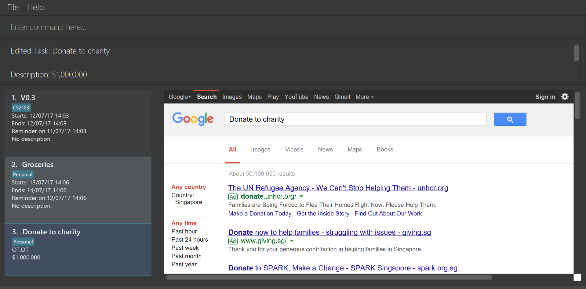

= https://cs2103jun2017-t3.github.io/main/[2Do]
ifdef::env-github,env-browser[:relfileprefix: docs/]
ifdef::env-github,env-browser[:outfilesuffix: .adoc]

https://travis-ci.org/CS2103JUN2017-T3/main[image:https://travis-ci.org/CS2103JUN2017-T3/main.svg?branch=master[Build Status]]
https://ci.appveyor.com/project/yogamurti/main[image:https://ci.appveyor.com/api/projects/status/02as2t45ruakidb4/branch/master?svg=true[Build status]]
https://coveralls.io/github/CS2103JUN2017-T3/main?branch=master[image:https://coveralls.io/repos/github/CS2103JUN2017-T3/main/badge.svg?branch=master&dummy=no_more_cache[Coverage Status]]
https://www.codacy.com/app/yogamurti/main?utm_source=github.com&amp;utm_medium=referral&amp;utm_content=CS2103JUN2017-T3/main&amp;utm_campaign=Badge_Grade[image:https://api.codacy.com/project/badge/Grade/293bb6c5af064a5f851765c0f9d2d3b4[Codacy Badge]]

ifdef::env-github[]

endif::[]

* 2Do is a *To Do List* desktop application. It has a GUI but most of the user interactions happen using a CLI (Command Line Interface).
* It is designed to allow users to efficiently manage their tasks.
* It is a Java application written in OOP fashion.

== Site Map

* <<UserGuide#, User Guide>>
* <<DeveloperGuide#, Developer Guide>>
* <<LearningOutcomes#, Learning Outcomes>>
* <<AboutUs#, About Us>>
* <<ContactUs#, Contact Us>>

== Acknowledgements

* Some parts of 2Do were inspired by the excellent http://code.makery.ch/library/javafx-8-tutorial/[Java FX tutorial] by
_Marco Jakob_.
* This project originated from the https://github.com/se-edu/addressbook-level4[Address Book] sample project created by _SE-EDU_.

== Licence : link:LICENSE[MIT]
